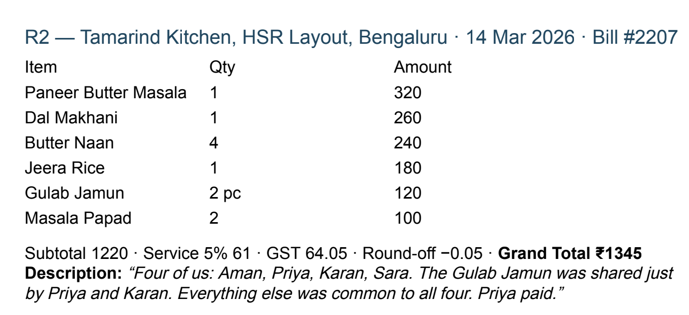
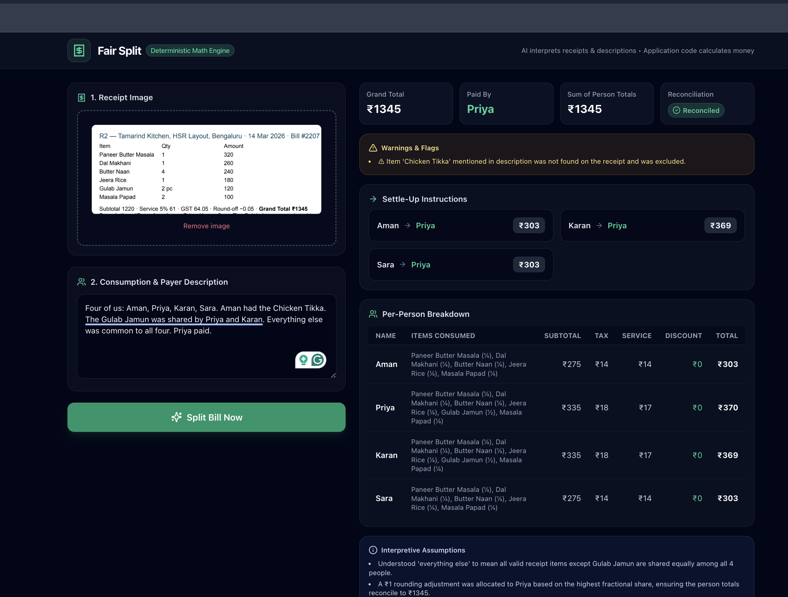
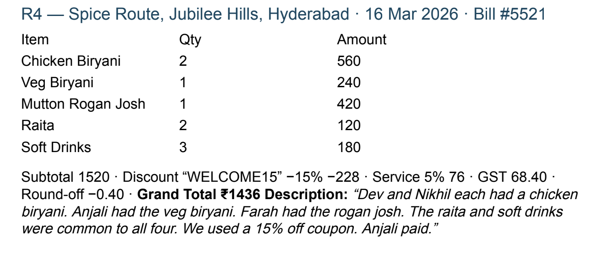
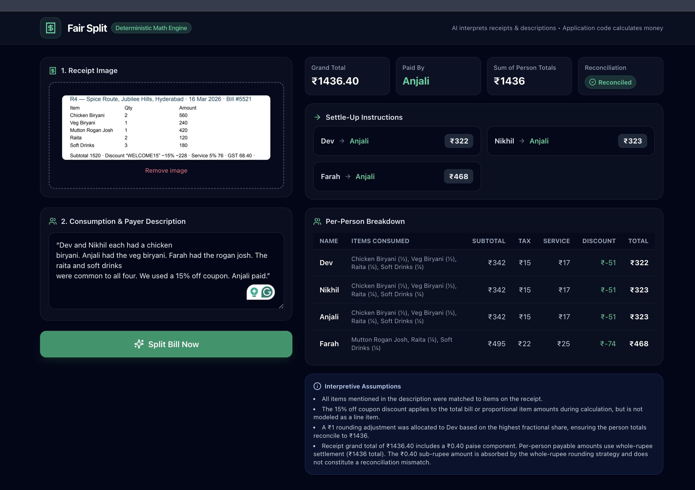
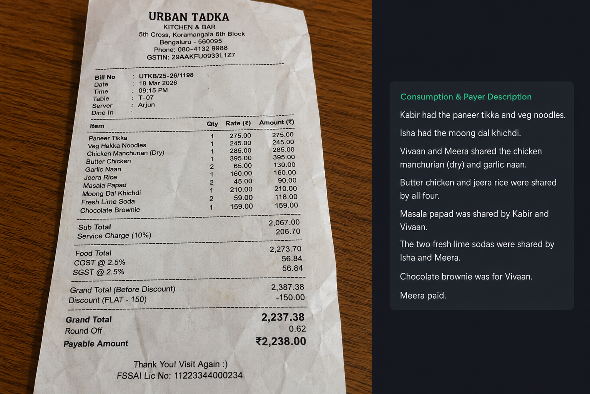
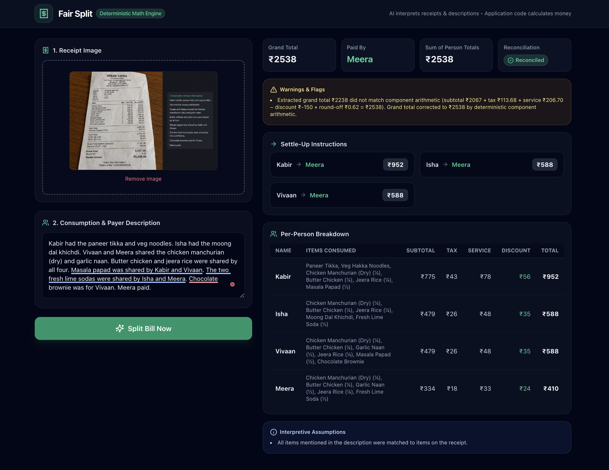
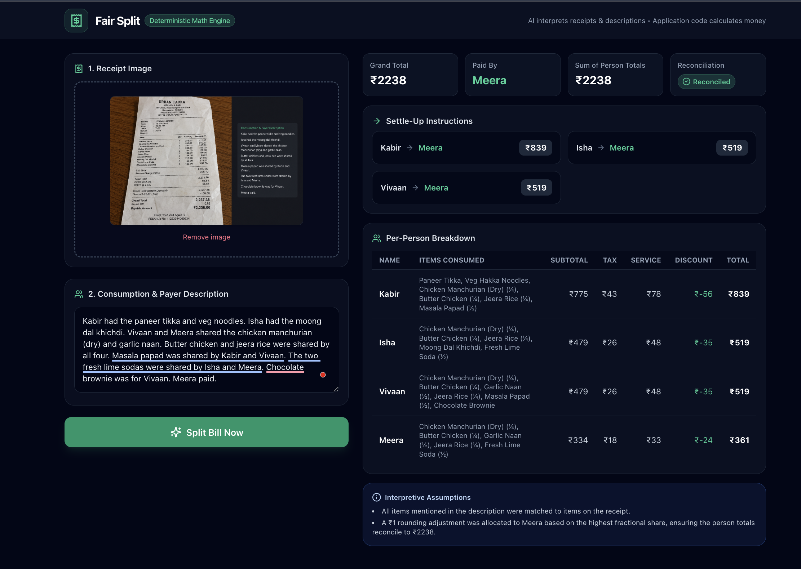

# Where the AI Was Wrong

This document records three issues found during manual testing where the AI extraction or interpretation was incorrect or incomplete. It also explains how each issue was caught and fixed using prompt improvements, validation, and deterministic application code.

---

## Issue 1 — Missing Receipt Item Was Treated as an Assumption

**Test:** R2 receipt

The description mentioned **"Chicken Tikka"**, but Chicken Tikka did not exist on the receipt.

### What went wrong

Gemini correctly noticed that the item was missing and did not invent a price for it.

However, it returned the problem as a normal `assumption`. That made a potentially important allocation problem look like harmless information.

### Fix

The prompt now tells Gemini not to allocate unmatched items.

The validation layer also checks the model's output. Missing receipt items are promoted to visible warning flags, and item allocations are independently checked against the receipt.

### Result

The application now warns the user instead of treating a missing item as a normal assumption.

---

## Issue 2 — Decimal Paise Was Dropped From the Grand Total

**Test:** R4 receipt

The receipt contained:

- Subtotal: ₹1520
- Discount: ₹228
- Service charge: ₹76
- GST: ₹68.40
- Grand total: ₹1436.40

### What went wrong

On some runs, Gemini extracted:

`grand_total: 1436`

instead of:

`grand_total: 1436.40`

It correctly read the ₹68.40 tax but dropped the `.40` from the final total.

### Fix

The extraction prompt was updated to explicitly preserve printed decimal values.

A second check was added in application code. Receipt values are converted to integer paise and compared. If the difference is only sub-rupee and the components clearly support the decimal value, the precision error can be corrected without asking the model to do arithmetic.

### Result

The same R4 case now keeps the correct ₹1436.40 receipt total and reconciles correctly.

---

## Issue 3 — Complex Receipt Structure Produced the Wrong Total

**Test:** Real restaurant receipt with several intermediate totals

The final payable amount printed on the receipt was **₹2238**.

### What went wrong

The receipt contained intermediate totals and charges.

Gemini's extracted components did not represent this structure correctly. The first version of the application's arithmetic guard trusted those components too much and replaced the printed ₹2238 total with **₹2538**.

This showed another problem: even deterministic code can produce the wrong answer if it blindly trusts incorrectly extracted AI data.

### Fix

The prompt was improved to distinguish intermediate receipt totals from the final payable amount.

More importantly, the arithmetic guard was made conservative:

- A small sub-rupee difference can be treated as a likely decimal extraction error.
- A difference of ₹1 or more is treated as a structural mismatch.
- For a large mismatch, the application keeps the printed grand total and flags the inconsistency instead of inventing a replacement.

### Result

Using the same receipt and description:

| | Result |
|---|---:|
| Before fix | ₹2538 |
| Printed payable amount | ₹2238 |
| After fix | **₹2238** |
| Sum of person totals | **₹2238** |
| Reconciliation | **Reconciled** |

---

## What I Took From These Failures

These failures shaped the main rule behind Fair Split:

> **Use AI for interpretation, not as the final authority on money.**

Gemini reads the receipt and understands the description. Its output is then checked before normal TypeScript code performs the split.

When something is clearly wrong, the application corrects only what it can safely prove. When it cannot safely decide, it flags the problem instead of guessing.